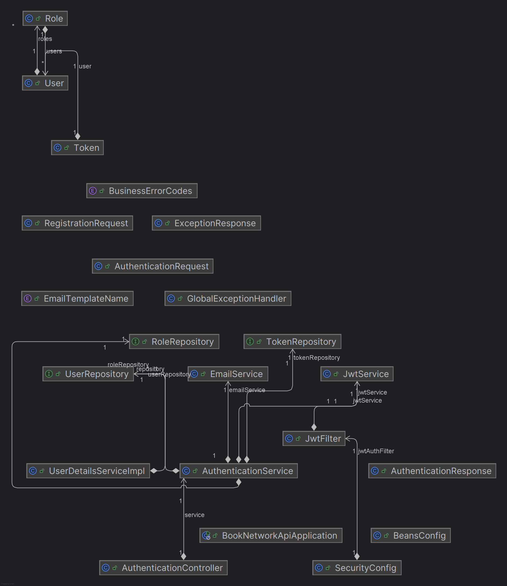
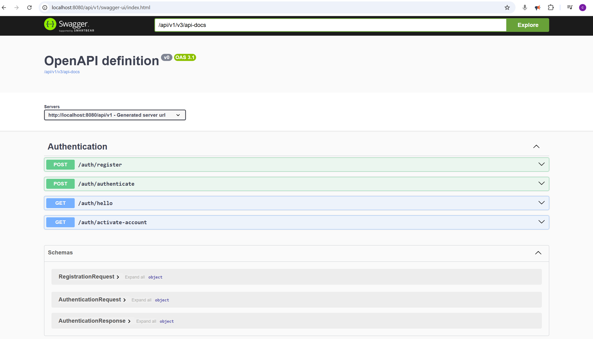

# springboot_monorepo
## versions
It is highly recommended to utilize the latest version for all packages. 
This approach can effectively prevent potential disruptions to your development progress caused by bugs inherent in older versions.
e.g.
```
springdoc-openapi-starter-webmvc-ui 2.8.5
```


## relevant docker commands(maildev && postgres)
```bath
docker run -p 1080:1080 -p 1025:1025 maildev/maildev  -d maildev

docker run --name my-postgres -e POSTGRES_PASSWORD=mysecretpassword -p 5432:5432 -d postgres

```
## screenshots
- dependencies

- swagger openapi

- docker compose


